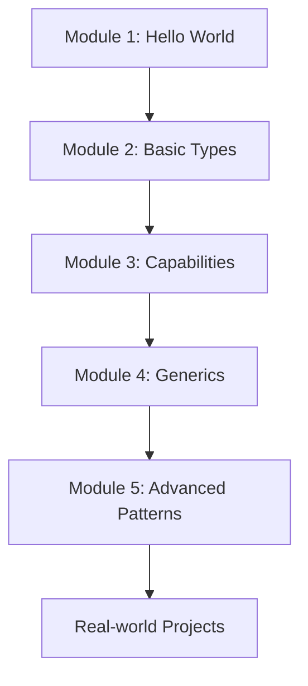

# Welcome to Move 101 Workshops

Giới thiệu đầu tiên bọn mình là [**First movers team**](https://linktr.ee/firstmoversvn) ở Việt Nam. Mục tiêu bọn mình hỗ trợ nhiều hoạt động cho devs bao gồm: Builder meetups, hackathon, hacker houses, bootcamps.. để tăng khả năng tiệp cận với hệ sinh thái Sui.

> In order to help more developers quickly understand and master the Move programming language. The Move learning events was jointly initiated by First Movers Viet Nam.

Đây là chuỗi các workshop thực hành và ví dụ. Hướng dẫn này sẽ đưa bạn từ các khái niệm cơ bản trong Sui Move. Bắt đầu từ các khái niệm cơ bản như: 

## 🚀 Quick Start

- **[Module 1: Hello World](/modules/module-1)** - Basic Move module structure and object creation
- **[Module 2: Basic Types](/modules/module-2)** - Move data types, functions, and control flow  
- **[Module 3: Capabilities](/modules/module-3)** - Access control and security patterns
- **[Module 4: Generics](/modules/module-4)** - Generic types and collections
- **[Module 5: Advanced Patterns](/modules/module-5)** - State management and events

## 📚 What You'll Learn

### Fundamentals
- Tổng quan về Sui Blockchain - kiến trúc, hiệu suất và điểm khác biệt
- Giới thiệu về Move - ngôn ngữ hướng đối tượng với ownership model.
- Các khái niệm chính: objects, modules, functions
- Cài đặt Sui CLI và viết module đầu tiên: "Hello Move"

### Intermediate Concepts
- Capability-based access control
- Generic types and reusable code
- Error handling and assertions
- Vector operations and collections

### Advanced Patterns
- State management with shared objects
- Event emission and handling
- Admin capabilities and permissions
- Real-world application patterns

## 🔗 Resources

- **[Source Code Repository](https://github.com/your-username/move-101-workshops-source)** - Complete source code for all modules
- **[Sui Documentation](https://docs.sui.io)** - Official Sui documentation
- **[Move Book](https://move-book.com)** - Comprehensive Move language guide

## 🛠️ Yêu cầu trước khi bắt đầu

Trước khi bắt đầu, hãy đảm bảo rằng bạn đã có:

- [Sui CLI](https://docs.sui.io/build/install) đã được cài đặt
- Kiến thức cơ bản về lập trình
- Một trình soạn thảo code (khuyến nghị dùng VS Code)
- Tài khoản testnet của Sui cùng với một ít token SUI

## 📖 Cách sử dụng hướng dẫn này

Mỗi module sẽ bao gồm:

1. **Tổng quan**:  Những khái niệm chính và nội dung bạn sẽ học
2. **Hướng dẫn từng bước**: Các bước triển khai chi tiết
3. **Ví dụ code**: Đoạn code đầy đủ có thể chạy được
4. **Bài tập**:  Các bài luyện tập để củng cố kiến thức
5. **Bước tiếp theo**: Gợi ý học thêm sau module này

## 🎯 Learning Path

